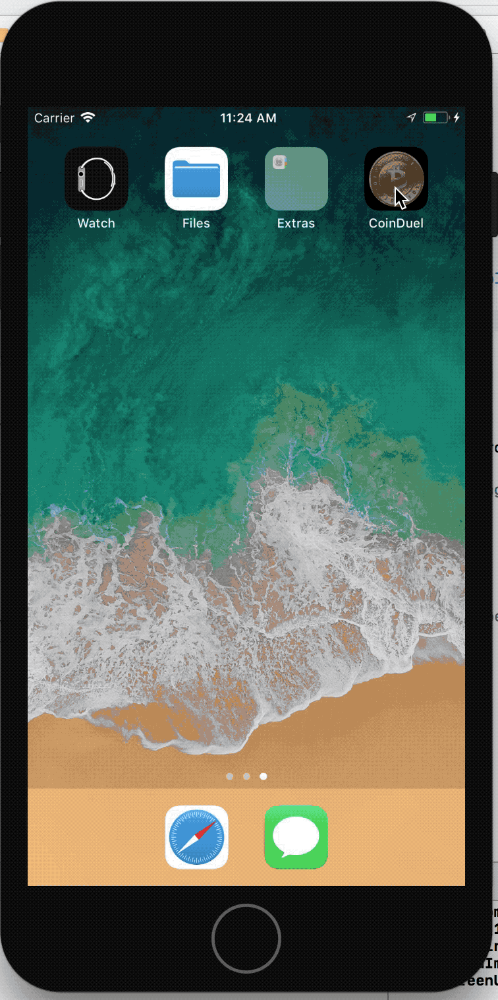

# CoinDuel

FanDuel meets cryptocurrency – Teaching people how to invest, one CapCoin at a time.

CoinDuel will be an application dedicated to educating investors about the volatility and value of cryptocurrencies in a safe setting where they can learn more about the blockchain, as well as learn to perform their own research and generate their own investment theses in order to participate in fun one-week challenge style format games to determine who can pick the best portfolio of currencies.

A couple of applications that inspired our app were HQ trivia, whose UI and payout method we hope to incorporate into our own application to some extent. Also, we hope emulate the simplicity and elegance of RobinHood in teaching people to invest in cryptocurrencies. Finally, we believe that creating a self sustaining economy built around CapCoin (name in progress) where our own psuedo-cryptocurrency acts as a rewards system within the app and can be redeemed to waive buy ins and for other rewards will lead to stickier users - this is similar to the model that SweatCoin followed, which was for a time the number one free app, despite the fact that SweatCoin was not actually built on the blockchain and was simply a cleverly named points system.

* Mockup:

## Architecture

Swift, Xcode

## Setup

Run workspace in Xcode
Be sure to 'open CoinDuel.xcworkspace' from terminal
This is the workspace that contains cocoa pods functionality

## Deployment

Xcode build
The above runs the simulator for the application

## GIFs of App in Action

## Authors

Kooshul Jhaveri, Anish Chadalavada, Mitchell Revers, Rajiv Ramaiah, Henry Wilson, Josh Kerber

## What would make this a better experience?

The experience with building this application this term was a wholly positive experience! I think it would be cool to maybe push up the MVP deadline by just a few days so everyone in the class could download/use everyone else's project for a few days and provide some feedback based on day to day use, and log what they liked/didn't liked
We think it would also be helpful to work with COSC 98 section 1 for a few class periods to hear their thoughts and recommendations on projects, and what to work on for an MVP, and what is best left to second term enhancements. Apart from that, everything was great!

## What worked this term / didn't work

We really enjoyed the design and pitch process at the beginning of the term, that got us thinking about what our project ideas might look like. The checkpoints were also helpful in keeping us on track.

## Potential Next Steps

We hope to enhance the existing user experience with several additional features next term (see Wiki page for more detail on user feedback and testing)

1. Access to more information in the form of the basic news and articles, as well as more advanced analysis and links to research and price trends over time, to help novice investors learn more about the currencies they are investing in

2. A buy-in option so that groups of friends can play among one another and win $$ for picking the optimal portfolio

3. Improved design and charts

4. Algorithmic or basic systematic trading, in the image of how Quantopian does this for stocks

5. Blockchain incorporation, so that CapCoin balances can be accessed in a decentralized manner
