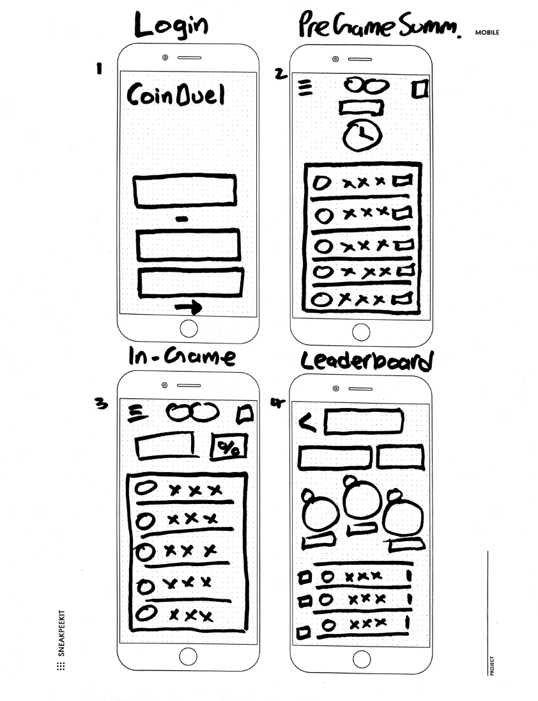
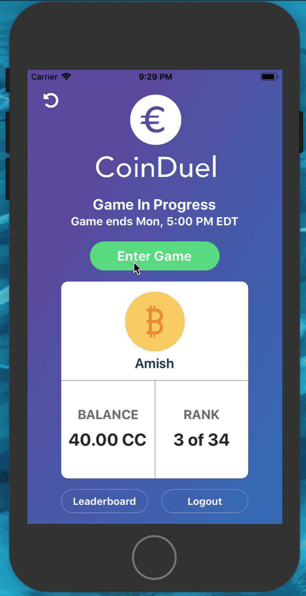
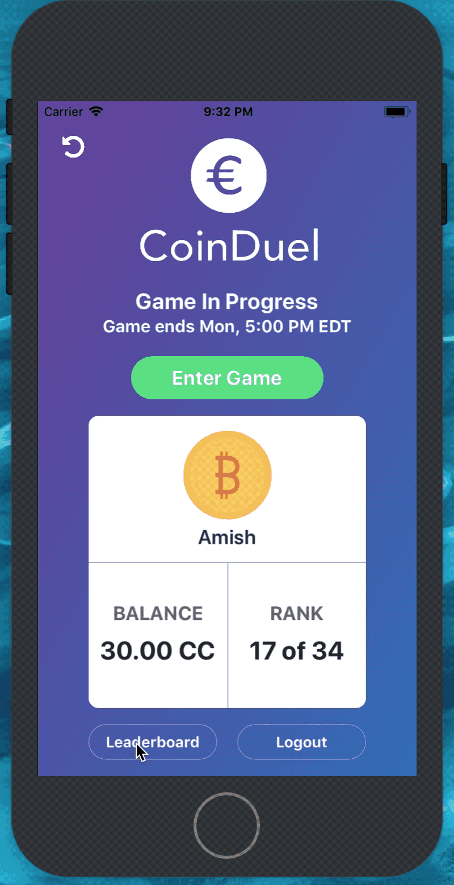
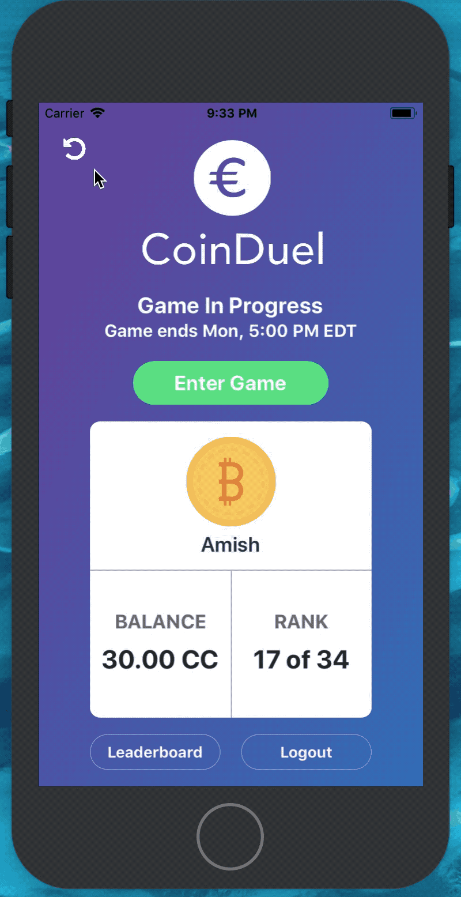

# CoinDuel

FanDuel meets cryptocurrency – Teaching people how to invest, one CapCoin at a time.

CoinDuel will be an application dedicated to educating investors about the volatility and value of cryptocurrencies in a safe setting where they can learn more about the blockchain, as well as learn to perform their own research and generate their own investment theses in order to participate in fun one-week challenge style format games to determine who can pick the best portfolio of currencies.

A couple of applications that inspired our app were HQ trivia, whose UI and payout method we hope to incorporate into our own application to some extent. Also, we hope emulate the simplicity and elegance of RobinHood in teaching people to invest in cryptocurrencies. Finally, we believe that creating a self sustaining economy built around CapCoin (name in progress) where our own psuedo-cryptocurrency acts as a rewards system within the app and can be redeemed to waive buy ins and for other rewards will lead to stickier users - this is similar to the model that SweatCoin followed, which was for a time the number one free app, despite the fact that SweatCoin was not actually built on the blockchain and was simply a cleverly named points system.

* Mockup:

## Architecture

Swift, Xcode

## Setup

Run workspace in Xcode
Be sure to 'open CoinDuel.xcworkspace' from terminal
This is the workspace that contains cocoa pods functionality

## Deployment

Xcode build
The above runs the simulator for the application

## GIFs of App in Action

Logging out, signing up and entering the app

Entering the game and selecting how to allocate your capcoin using the new trade view

Showing the all time and current game leaderboard views

Showing the refresh and in game view

Showing the CoinDetail and informational view

## Authors

Kooshul Jhaveri, Anish Chadalavada, Mitchell Revers, Rajiv Ramaiah, Henry Wilson, Josh Kerber

## What would make this a better experience?

The experience with building this application this term was a wholly positive experience! Again, I think it would be cool to maybe push up the deadline by just a few days so everyone in the class could download/use everyone else's project for a few days and provide some feedback based on day to day use, and log what they liked/didn't liked

See below for more on what could have been better.

The experience overall was a really positive one and we really enjoyed working on it!

## User Feedback / Conclusions

We got really positive feedback from users at the Technigala, as we incorporated all of the suggested changes from the user feedback we received during the first term. They particularly enjoyed the ability to trade in game, and one or two of our testers indicated that it would be very interesting to see a trade history or live in game trading view of all trades that had taken place in the game, similar to an exchange. Users also really enjoyed the UI and the charts as well as the informational aspect of the app, so we are very proud of what we accomplished this term. Based on this user feedback, we can probably incorporate a more interactive/robust informational screen as well a more robust trade history view. Users also indicated that the onboarding view at the beginning was helpful.

## What worked this term / didn't work

This term, the bug hunts as well as the time we spent brainstorming ideas to advance the app and come up with a good division of labor really helped us to solidify our vision for the project. We spent time mocking up how trades and blockchain could be implemented and seamlessly integrated into the app and the frontloading of time dedicated to design helped us a great deal.

I can't really think of much that did not work well this term. I think it would be good to have a few more bug hunts throughout the term and it might have been good to have a workshop or two for rigorous UI testing of each others' products. Perhaps if two groups were paired and had a weekly checkin to stress test each others apps it could yield good results for the teams.

## Potential Next Steps

If we could take this app further we would do a few things to further the project (see Wiki page for more detail on user feedback and testing)

1. We would add an interactive coaching tab to help people optimize their investment strategy, as well as help them to have information beyond news articles. Something more interactive like videos and live graphs and stats would be cool.

2. We want to expand Capcoin so that it is tradeable or can be exchanged in some way for US dollars or another cryptocurrency so that we can build out our rewards system. This could also help us create and monetize a reward for game winners and attract more users

3. We also want to incorporate a live trades view so that users can view their trade history and a record of all the trades that everyone has made in the game.

These were our term goals for the last term as well as our comments on how they panned out.

1. Access to more information in the form of the basic news and articles, as well as more advanced analysis and links to research and price trends over time, to help novice investors learn more about the currencies they are investing in

We built out an informational aspect to the Coin Detail view so that users could have access to further links and information about coins.

3. Improved design and charts

We spent a great deal of time improving the design and fully implementing and incorporating the charts and we think it looks great.

4. Algorithmic or basic systematic trading, in the image of how Quantopian does this for stocks

We didn't implement systematic trading but we did implement the more important element of trading which was the ability to trade in order to enter or exit positions in game

5. Blockchain incorporation, so that CapCoin balances can be accessed in a decentralized manner

We did successfully implement blockchain with a full proof of work algorithm!
